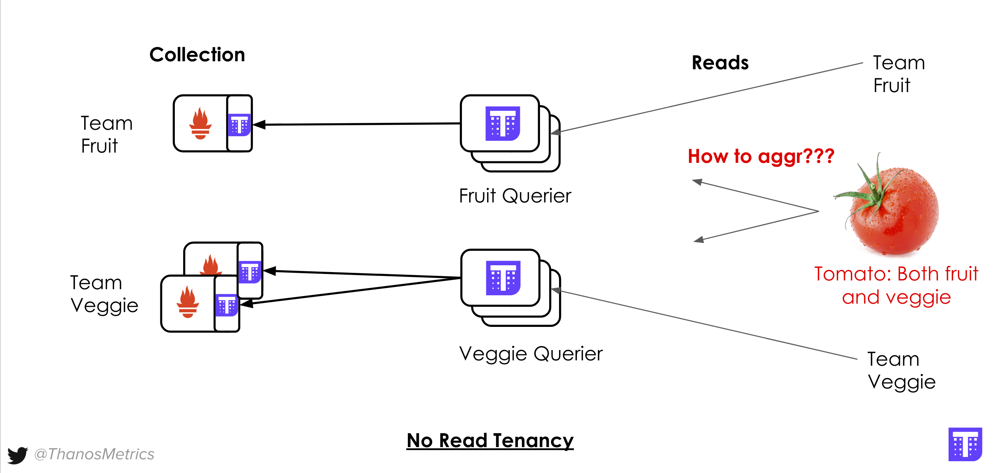
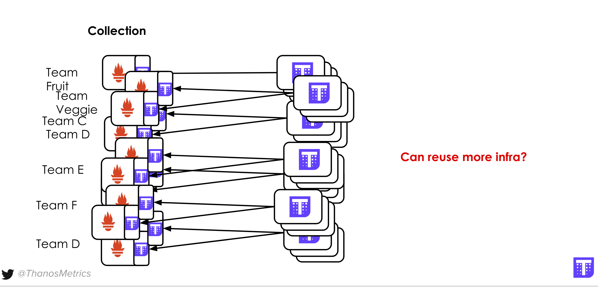
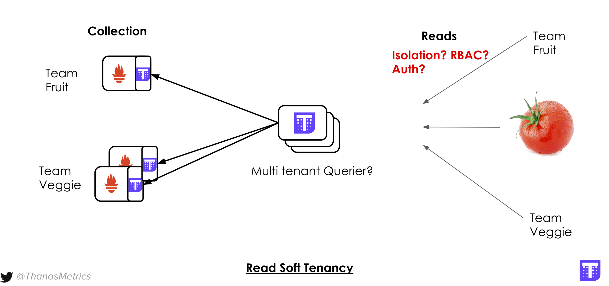
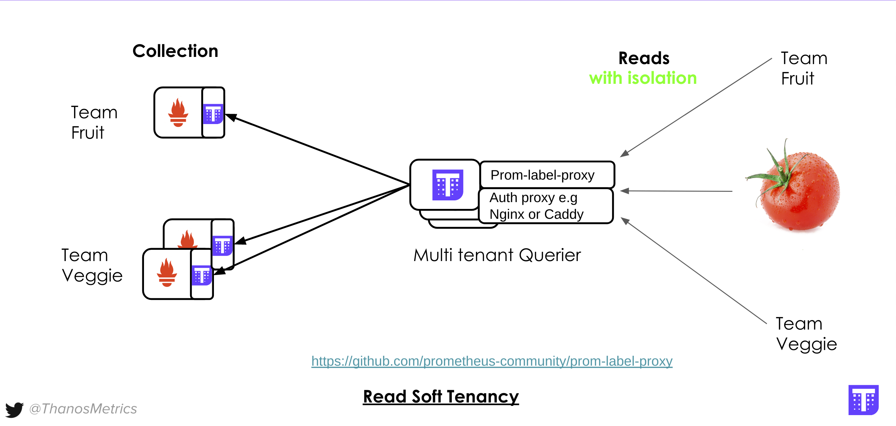

## So You Have Two Teams?
#### Scenario
Let's imagine we have to deliver centralized metrics platform to two teams Team Fruit and Team Veggie. We don't want each team to see each other data or even know about their existence. Let's see how we achieve that with Thanos.
#### Starting Fruit and Veggie Prometheus and Thanos Global View
Fruits and Veggies want to allow more Prometheus and replicas at some point so they want to have Thanos upfront. Let's quickly deploy Prometheuses with sidecars and Querier.
#### Configure Prometheus-es
First, Prometheus server for Team Fruit that scrapes itself:
```
global:
  scrape_interval: 5s
  external_labels:
    cluster: eu1
    replica: 0
    tenant: team-fruit

scrape_configs:
  - job_name: 'prometheus'
    static_configs:
      - targets: ['127.0.0.1:9090']
```
For the Team Veggie we set second instance with two replicas (Veggies care for high availability - everyone should eat vegetables every day after all!):
```
global:
  scrape_interval: 5s
  external_labels:
    cluster: eu1
    replica: 0
    tenant: team-veggie

scrape_configs:
  - job_name: 'prometheus'
    static_configs:
     - targets: ['127.0.0.1:9091','127.0.0.1:9092']
```
```
global:
  scrape_interval: 5s
  external_labels:
    cluster: eu1
    replica: 1
    tenant: team-veggie

scrape_configs:
  - job_name: 'prometheus'
    static_configs:
      - targets: ['127.0.0.1:9091','127.0.0.1:9092']
```

#### Prepare "persistent volumes"
Execute following commands:
```
mkdir -p prometheus0_fruit_data prometheus0_veggie_data prometheus1_veggie_data
```
#### Deploying Team Fruit Prometheus with sidecar
```
docker run -d --net=host --rm \
    -v $(pwd)/editor/prometheus0_fruit.yml:/etc/prometheus/prometheus.yml \
    -v $(pwd)/prometheus0_fruit_data:/prometheus \
    -u root \
    --name prometheus-0-fruit \
    quay.io/prometheus/prometheus:v2.20.0 \
    --config.file=/etc/prometheus/prometheus.yml \
    --storage.tsdb.path=/prometheus \
    --web.listen-address=:9090 \
    --web.external-url=https://2886795302-9090-ollie09.environments.katacoda.com \
    --web.enable-lifecycle \
    --web.enable-admin-api && echo "Prometheus for Fruit Team started!"
```
```
docker run -d --net=host --rm \
    -v $(pwd)/editor/prometheus0_fruit.yml:/etc/prometheus/prometheus.yml \
    --name prometheus-0-sidecar-fruit \
    -u root \
    quay.io/thanos/thanos:v0.17.2 \
    sidecar \
    --http-address 0.0.0.0:19090 \
    --grpc-address 0.0.0.0:19190 \
    --reloader.config-file /etc/prometheus/prometheus.yml \
    --prometheus.url http://127.0.0.1:9090 && echo "Started sidecar for Fruit Prometheus"
```
#### Same for Team Veggie, but with 2-replica Prometheus:
First:
```
docker run -d --net=host --rm \
    -v $(pwd)/editor/prometheus0_veggie.yml:/etc/prometheus/prometheus.yml \
    -v $(pwd)/prometheus0_veggie_data:/prometheus \
    -u root \
    --name prometheus-0-veggie \
    quay.io/prometheus/prometheus:v2.20.0 \
    --config.file=/etc/prometheus/prometheus.yml \
    --storage.tsdb.path=/prometheus \
    --web.listen-address=:9091 \
    --web.external-url=https://2886795302-9091-ollie09.environments.katacoda.com \
    --web.enable-lifecycle \
    --web.enable-admin-api && echo "Prometheus for Veggie Team started!"
```
```
docker run -d --net=host --rm \
    -v $(pwd)/editor/prometheus0_veggie.yml:/etc/prometheus/prometheus.yml \
    --name prometheus-0-sidecar-veggie \
    -u root \
    quay.io/thanos/thanos:v0.17.2 \
    sidecar \
    --http-address 0.0.0.0:19091 \
    --grpc-address 0.0.0.0:19191 \
    --reloader.config-file /etc/prometheus/prometheus.yml \
    --prometheus.url http://127.0.0.1:9091 && echo "Started sidecar for Veggie Prometheus"
```
Second:
```
docker run -d --net=host --rm \
    -v $(pwd)/editor/prometheus1_veggie.yml:/etc/prometheus/prometheus.yml \
    -v $(pwd)/prometheus1_veggie_data:/prometheus \
    -u root \
    --name prometheus-1-veggie \
    quay.io/prometheus/prometheus:v2.20.0 \
    --config.file=/etc/prometheus/prometheus.yml \
    --storage.tsdb.path=/prometheus \
    --web.listen-address=:9092 \
    --web.external-url=https://2886795302-9092-ollie09.environments.katacoda.com \
    --web.enable-lifecycle \
    --web.enable-admin-api && echo "Prometheus for Veggie Team started!"
```
Second:
```
docker run -d --net=host --rm \
    -v $(pwd)/editor/prometheus1_veggie.yml:/etc/prometheus/prometheus.yml \
    --name prometheus-01-sidecar-veggie \
    -u root \
    quay.io/thanos/thanos:v0.17.2 \
    sidecar \
    --http-address 0.0.0.0:19092 \
    --grpc-address 0.0.0.0:19192 \
    --reloader.config-file /etc/prometheus/prometheus.yml \
    --prometheus.url http://127.0.0.1:9092 && echo "Started sidecar for Veggie Prometheus"
```
#### Querier
Now the naive approach to ensure querying isolation (we can't affort veggies to look on fruits data!) would be to setup separate isolated Queriers for each team, so let's start with that.

Fruit:
```
docker run -d --net=host --rm \
    --name querier-fruit \
    quay.io/thanos/thanos:v0.17.2 \
    query \
    --http-address 0.0.0.0:29091 \
    --grpc-address 0.0.0.0:29191 \
    --query.replica-label replica \
    --store 127.0.0.1:19190 && echo "Started Thanos Fruit Querier"
```
Veggie:
```
docker run -d --net=host --rm \
    --name querier-veggie \
    quay.io/thanos/thanos:v0.17.2 \
    query \
    --http-address 0.0.0.0:29092 \
    --grpc-address 0.0.0.0:29192 \
    --query.replica-label replica \
    --store 127.0.0.1:19191 \
    --store 127.0.0.1:19192 && echo "Started Thanos Veggie Querier"
```
#### Setup Verification
At the end we should see this case:


This setup can be called "No or Hard Tenancy" where we are setting up separate components (technically disonnected two systems) for each of tenants.

Once started you should be able to reach both Queriers - each exposing either Fruit's or Veggies's data:

Fruit Query
Veggies Query

#### Problem statement 1: Tomato problem.
Let's try to play with this setup a bit. You are free to query any metrics. Data isolation is there, each team has its own endpoint.

However, let's try to imagine a common case in such setups: What if you are.. a Tomato? Surprisingly Tomato is both fruit and vegetable, so we it should be able not only to access metrics from both Veggie and Fruit teams, but also run PromQL across them.



We call this "Tomato" problem a Cross-tenant or Admin View and it's a common case when teams/tenants are changing, users have access to multiple tenants data etc. This can be solved with another layer of global view: we know how to solve this problem from previous courses, we could start another Querier on top of our Team's Queries and open another endpoint just for Tomatoes. But here comes another problem...

#### Problem statement 2: Exclusive Infra for Each Tenant is very Expensive and does not scale.


## Thanos Query Multi Tenancy
What if we can have one set of Queries instead of separate set for each tenant? Why not reusing exactly same component?

Let's stop fruit and veggies queriers and run single one spanning all the tenant's Prometheus data:
```
docker stop querier-fruit && docker stop querier-veggie
```
```
docker run -d --net=host --rm \
    --name querier-multi \
    quay.io/thanos/thanos:v0.17.2 \
    query \
    --http-address 0.0.0.0:29090 \
    --grpc-address 0.0.0.0:29190 \
    --query.replica-label replica \
    --store 127.0.0.1:19190 \
    --store 127.0.0.1:19191 \
    --store 127.0.0.1:19192 && echo "Started Thanos Querier with access to both Veggie's and Fruit's data"
```
Within short time we should be able to see "Tomato" view when we open Querier UI

#### Tenant Query Isolation
Undoubtedly, the main problem with this setup is that by default every tenant will see each other data, similar to what you have in Prometheus, if single Prometheus scrapes data from multiple teams.


Both Prometeus and Thanos follow UNIX philosopy. One of the principles is to ensure each component is doing one thing and do it well. Thanos Querier does not perform any authentication or authorization. This is because you probably already have consistent auth mechanism in your organization. So why not composing that with flexible flat label pairs identifing the data blocks and each individual series for data isolation?

#### Meet prom-label-proxy
prom-label-proxy allows read tenancy for all the resources that Prometheus and Thanos currently exposes, by enforcing certain tenant label to be used in all APIs retrieving the data. This proxy works natively for Prometheus, but since Thanos uses same HTTP APIs on top, it will work for us as well.

So why not we start something like this in front of our "Tomato" Querier?

```
docker run -d --net=host --rm \
    --name prom-label-proxy \
    quay.io/thanos/prom-label-proxy:v0.3.0-rc.0-ext1 \
    -label tenant \
    -upstream http://127.0.0.1:29090 \
    -insecure-listen-address 0.0.0.0:39090 \
    -non-api-path-passthrough \
    -enable-label-apis && echo "Started prom-label-proxy"
```
#### Laveraging prom-label-proxy
All requests now have to have extra URL paramter tenant= with the value being tenant to limit scope with.

Our running proxy does not do any authN or authZ for us - so let's setup some basic flow. To make it simple, let's deploy Caddy server (kind of fancy nginx but written in Go) that will expose two ports: 39091 that will redirect to prom-label-proxy with tenant=team-fruit and 39092 for tenant=team-veggie injection.

Let's create Caddy config file:

```
{
    admin off
}

:39091  {
    rewrite * ?{query}&tenant=team-fruit
    reverse_proxy 127.0.0.1:39090
}

:39092 {
    rewrite * ?{query}&tenant=team-veggie
    reverse_proxy 127.0.0.1:39090
}
```

And start our caddy server using that config:

```
docker run -d --net=host --rm \
    --name caddy \
    -v $PWD/editor/Caddyfile:/etc/caddy/Caddyfile \
    caddy:2.2.1 && echo "Started Caddy Server"
```
#### Verification

At the end we shoud have setup as on following diagram:

